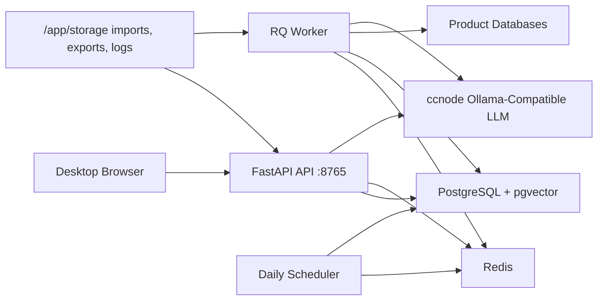

# AnySQL Architecture

## Capacity Target

AnySQL is now structured as a small team service for roughly 50 concurrent business users.

The service supports:

- Shared product definitions, prompt rules, metadata snapshots, SQL knowledge, drafts, and job history.
- SQL-only chat workflows that retrieve, score, generate, revise, and explicitly accept SQL.
- Background metadata sync, SQL analysis, and embedding rebuild jobs outside API request threads.
- Durable container rebuilds through mapped host data under `deploy-data`.
- No login in the first team release, with `created_by`, `updated_by`, and `accepted_by` fields reserved for later auth/audit integration.

## Runtime Topology

Default Compose services:

- `api`: FastAPI web/API process on port `8765`.
- `worker`: RQ worker for long-running jobs.
- `scheduler`: daily metadata delta sync scheduler.
- `postgres`: PostgreSQL with pgvector extension.
- `redis`: RQ broker.

## System Of Record

PostgreSQL owns canonical data:

- `products`: immutable physical IDs, editable product codes, names, descriptions, rules, and soft-delete state.
- `product_db_connections`: product database connection profiles.
- `metadata_tables` and `metadata_columns`: product metadata snapshots, hashes, and sync versions.
- `sql_records` and `sql_analyses`: accepted and imported SQL knowledge plus analysis.
- `sql_drafts`: generated or revised SQL awaiting human acceptance.
- `knowledge_acceptances`: explicit acceptance audit records.
- `jobs`: queued/running/succeeded/failed/cancelled task status and progress.
- `sql_embeddings` and `metadata_embeddings`: pgvector-backed semantic retrieval data.

Files are not canonical knowledge in team mode. They are used for imports, exports, and diagnostics.

## Knowledge Safety

Generated SQL does not enter `sql_records` or `sql_embeddings` automatically. The API stores it as a draft only. `POST /api/assistant/learn` is the explicit acceptance boundary; only then does AnySQL create accepted SQL knowledge, acceptance audit rows, and embeddings.

This prevents bad generated SQL from polluting retrieval results.

## Retrieval Flow

1. Normalize non-Japanese questions toward Japanese because UPDS metadata is Japanese.
2. Search accepted SQL embeddings in `sql_embeddings`.
3. Search metadata embeddings in `metadata_embeddings`.
4. Ask the LLM to score candidate SQL match quality.
5. Return a matched SQL when confidence is high enough.
6. Generate a draft from metadata RAG and known SQL examples when confidence is low.
7. Persist only after human acceptance.

## Background Jobs

Long jobs run through Redis/RQ and persist state in `jobs`:

- `metadata_initial_sync`: enqueued when a new product is created.
- `metadata_delta_sync`: enqueued manually and by the daily scheduler.
- `sql_analysis`: imports/analyzes SQL files.
- `embedding_rebuild`: rebuilds SQL and metadata embeddings.

Job statuses are `queued`, `running`, `succeeded`, `failed`, and `cancelled`.

## Persistence

Compose maps all durable state to host paths:

- `./deploy-data/config:/app/config`
- `./deploy-data/imports:/app/storage/imports`
- `./deploy-data/exports:/app/storage/exports`
- `./deploy-data/logs:/app/storage/logs`
- `./deploy-data/postgres:/var/lib/postgresql/data`
- `./deploy-data/redis:/data`

Container rebuilds and `docker compose down` do not remove products, metadata, accepted SQL, embeddings, or job history. Deleting `deploy-data` intentionally resets the environment.

## Migration

`python -m anysql.migrate_local` imports local `config.yaml` and `products/` assets into PostgreSQL.

The migrator:

- Imports products and database connections.
- Imports successful SQL analysis JSON records.
- Imports metadata table JSON files.
- Skips generated drafts by default.
- Skips failed SQL analysis records.
- Rebuilds pgvector embeddings when requested.
- Prints a migration report with imported, skipped, and failed counts.

## Operational Notes

- The default LLM endpoint is the ccnode Ollama-compatible service: `http://ccnode.briconbric.com:22545`.
- PostgreSQL and Redis are internal Compose services, not exposed to the host by default.
- First release has no login. Audit columns are present so auth can be added without reshaping the schema.
- Product database passwords are stored through a placeholder encryption interface; production should replace it with real encryption or a secret manager before wider rollout.
