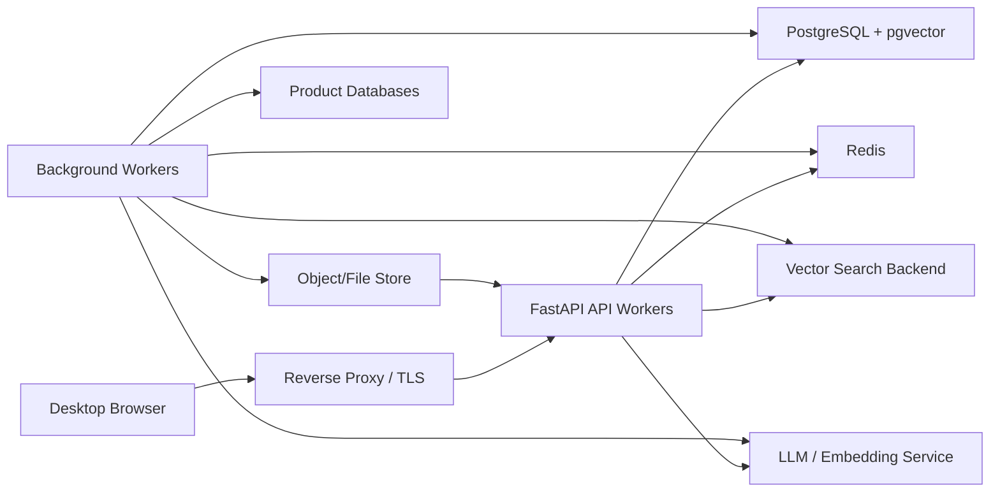

# AnySQL Architecture

## Capacity Target

AnySQL is designed to move from a local validation tool to a small team service for roughly 50 concurrent business users.

The production target is:

- Multiple users can chat, search, generate, revise, and accept SQL at the same time.
- Product definitions, rules, accepted SQL knowledge, metadata snapshots, and sync history are shared and durable.
- Metadata sync and SQL analysis run as background jobs, not in the web request process.
- Bad generated SQL never becomes knowledge unless a user explicitly accepts it.
- The service can be backed up, restored, monitored, and upgraded without relying on one developer's local files.

## Current Implementation

The current implementation still has local-mode components:

- `config.yaml` stores products and secrets.
- `products/{product}/sql` stores source and accepted generated SQL files.
- `products/{product}/desc` stores SQL analysis JSON.
- `products/{product}/metadata` stores metadata snapshots.
- `data/chroma_db` stores ChromaDB persistent vector data.
- FastAPI `BackgroundTasks` and in-process maps hold sync/progress state.

This is acceptable for local development and validation, but not enough for a 50-user shared deployment.

## Production Target Architecture

Recommended default for the next stage:

- PostgreSQL as the system of record.
- pgvector in PostgreSQL for vectors at this scale, or Qdrant if vector load grows.
- Redis for job queue, locks, rate limiting, and short-lived session state.
- Background workers for metadata sync, SQL analysis, embedding, and scheduled jobs.
- File/object storage only for original uploaded files and exports, not for canonical knowledge state.

## Data Ownership

PostgreSQL should own:

- Products, immutable product physical IDs, editable product codes, names, descriptions, and prompt rules.
- Product database connection profiles, with passwords encrypted or delegated to a secret manager.
- Metadata tables, columns, comments, hashes, sync versions, and sync job history.
- SQL statements, SQL analysis, acceptance state, reviewer/user actions, and knowledge versions.
- Chat sessions, messages, draft SQL, accepted SQL, rejected SQL, and feedback.
- Audit events.

Vector backend should own:

- Accepted SQL knowledge embeddings.
- Metadata embeddings.
- Optional conversation/query embeddings.

File/object storage should own:

- Imported source SQL files.
- Exported SQL bundles.
- Diagnostic artifacts that are not canonical knowledge.

## Storage Decision

For about 50 users, PostgreSQL with pgvector is the pragmatic first production backend:

- One backup/restore story for relational data and vectors.
- Transactions make acceptance, versioning, and vector updates easier to keep consistent.
- Operational complexity is lower than running a separate vector database.
- Query volume is expected to be manageable for this scale.

Use Qdrant or another dedicated vector database later if:

- Metadata grows to millions of chunks.
- Vector search latency becomes the bottleneck.
- Separate vector scaling or advanced vector filtering is required.

Chroma local persistent storage remains useful for local development only.

## Background Jobs

Move these jobs out of FastAPI request workers:

- Initial product metadata sync after product creation.
- Daily differential metadata sync.
- Manual metadata sync.
- SQL analysis and re-analysis.
- Embedding rebuilds.

Recommended implementation:

- Celery or RQ workers.
- Redis as broker and lock backend.
- PostgreSQL `sync_jobs` table for durable status, progress, retry count, and error details.

## Migration Plan

### Phase 1: Configuration and Contracts

- Add explicit storage configuration for local, PostgreSQL, Redis, and vector backend selection.
- Keep local mode working.
- Document that local Chroma/file storage is not the production architecture.

### Phase 2: System Database

- Introduce SQLAlchemy models and Alembic migrations.
- Move products, rules, SQL records, accepted knowledge, metadata index, sync status, and chat history into PostgreSQL.
- Keep product files as import/export artifacts only.

### Phase 3: Vector Backend

- Implement a vector repository interface.
- Add pgvector backend.
- Keep Chroma local backend for development.
- Store source hashes and embedding model versions to support differential re-embedding.

### Phase 4: Worker Queue

- Replace FastAPI `BackgroundTasks` and in-memory progress maps with Redis-backed workers and durable job rows.
- Add concurrency limits per product and per embedding/LLM provider.

### Phase 5: Operations

- Add Docker Compose for PostgreSQL, Redis, API, and worker.
- Add health checks, backup notes, retention policies, and observability.
- Add admin APIs for job retry, cancel, and reindex.

## Open Decisions

- Password handling: database field encryption in PostgreSQL vs external secret manager.
- Authentication: currently no login; 50-user deployment likely needs at least corporate SSO or a simple internal auth layer.
- Vector backend: pgvector as default vs Qdrant if separate vector service is preferred.
- Job runner: Celery vs RQ. RQ is simpler; Celery is stronger for scheduled/retry-heavy workloads.
